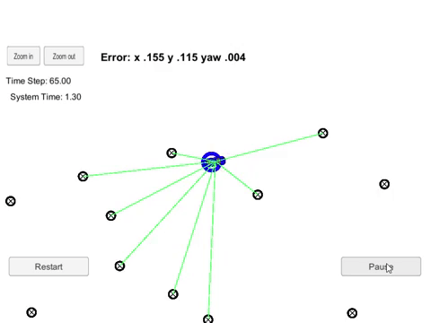

# Kidnapped Vehicle
>   
> [Full Video](https://youtu.be/43LW9t7uklo) on YouTube
# Objective
> Your robot has been kidnapped and transported to a new location! Luckily it has a map of this location, a (noisy) 
GPS estimate of its initial location, and lots of (noisy) sensor and control data. In this project you will implement
 a 2 dimensional particle filter in C++. Your particle filter will be given a map and some initial localization 
 information (analogous to what a GPS would provide). At each time step your filter will also get observation and 
 control data.
>
# What I learned
> - General Bayes filter
> - Sparse localization
> - Particle filter
> - Markov localization
> 
> #### Languages
> C++
